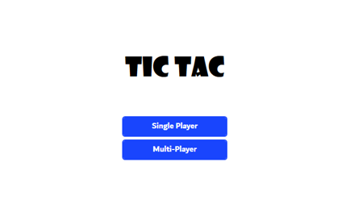
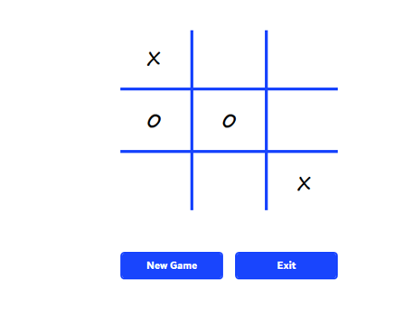
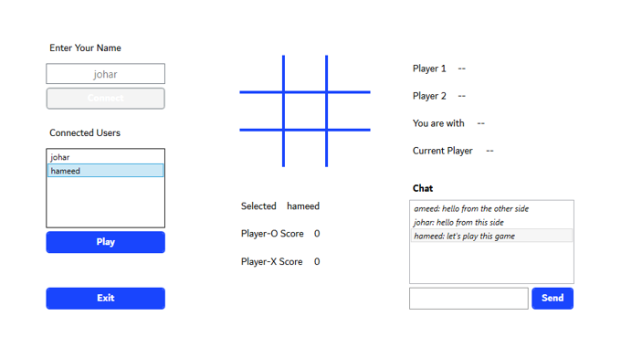
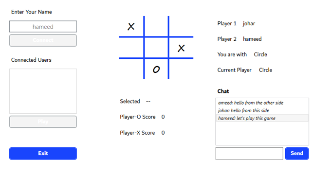

# MultiPlayer-Tic-Tac-Game-Using-Socket-Programming

###	Introduction 
In this project we have implemented a multiplayer tic tac toe game using socket programming in C# in which a server creates the game in local area network. The players in LAN can connect to the server by using the IP address of the server. We have used the concept of thread. When a new client connection arrives to server, new thread will be created and user will be able to play against the opponent player. Rules of the game: One by one the players have to click on buttons, ‘O’ or ‘X’. A player can win the game when either of the diagonals have the same key i.e., ‘O’ or ‘X’ or any of the rows or the columns have the same key otherwise the game will result in a draw. User can also play as a single player against an undefeatable AI.
###	Scope and Modules
#### Scope:

-	Tools Used:  
`C#`
`Visual Studio 2019`
`WPF (.Net Framework)`
`Socket Programming`
-	User can play as single player against AI
-	User can play as multiplayer against opponents through LAN
-	User can connect to server by entering their name
-	User can choose from list of available players to play with.
-	Users can chat with each other through chat system
-	Users can view their scores
#### Modules:
1. <b>Client-side modules</b>
   - MainWindow
   - MultiPlayer
   - SinglePlayer
2. <b>Server-side modules</b>
   - MainWindow

### Steps To Play This Game

📝IMPORTANT NOTE📝
- open cmd/terminal and type `ipconfig`
- Copy IPv4/IPv6 address, then open `Client/MultiPlayer.xaml.cs` file and assign your ip address to this `SERVER_IP_ADDRESS` variable.
  
- Server and Client both are seperate projects
1. First run both server and client projects one by one so that it creates .exe file for both.
2. Go to <i>\TicTacGame\Server\bin\Debug</i>
3. Open Server.exe file/app
4. After Server App Opens Click `Start`
5. Now CLIENT Side
6. Go to <i>\TicTacGame\Client\bin\Debug</i>
7. Open Client.exe
8. You can either play SinglePlayer or MultiPlayer
9. With `SinglePlayer` you can play with an AI
10. when you click on `MultiPlayer` another window will open.
11. Enter Your Name and click `Connect`
12. After that open another instance of Client.exe
13. Enter your name and click `Connect`
14. Select your opponent from list and click `Play`
15. Congrats🎉🎊 You can now play and chat with an opponent
16. when you dont want to play anymore exit Client.exe and on Server.exe click `Stop` button and then exit.
17. THE END!!

### ScreenShots
#### Home Screen

#### Single Player

#### Multi Player

